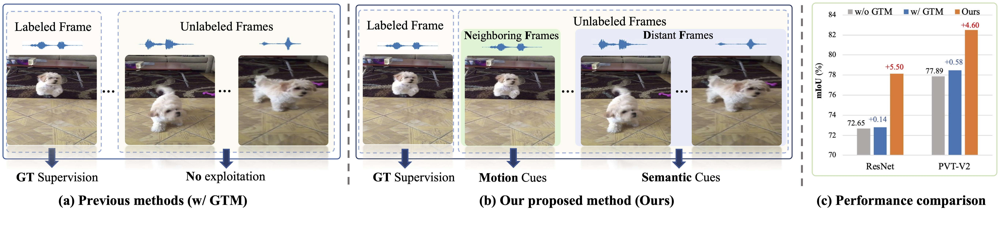

# CVPR2024: Audio-Visual Segmentation via Unlabeled Frame Exploitation

Official implementation of  [Audio-Visual Segmentation via Unlabeled Frame Exploitation](https://arxiv.org/abs/2403.11074).

This paper has been accepted by **CVPR 2024**, the project page is [https://jinxiang-liu.github.io/UFE-AVS/](https://jinxiang-liu.github.io/UFE-AVS/)).



***********

## Get Started

### Implementation
Our proposed method is versatile for all existing AVS methods theoretically, in this work we implement the method on top of two representative methods including [TPAVI](https://github.com/OpenNLPLab/AVSBench) and [AVSegFormer](https://github.com/vvvb-github/AVSegFormer). 
Therefore, our implementation is also based on the authors' released codes and we express our thanks to them.
Please check their original repositries for environment configuration details.

To perform training or inference of method on top either of the two baselines, please enter the corresponding directory and run the scripts.


### Data and Model weights
About the data inlcuding the flows from AVSBench and extended flows, please check the `PREPARATION.md` to download.

About the model weights, we release all weights based on TPAVI and AVSegFormer on both subsets of AVSBench, please check the `PREPARATION.md` for download links.


***********
## Citation
```txt
@article{liu2024audio,
  title={Audio-Visual Segmentation via Unlabeled Frame Exploitation},
  author={Liu, Jinxiang and Liu, Yikun and Zhang, Fei and Ju, Chen and Zhang, Ya and Wang, Yanfeng},
  journal={arXiv preprint arXiv:2403.11074},
  year={2024}
}
```
